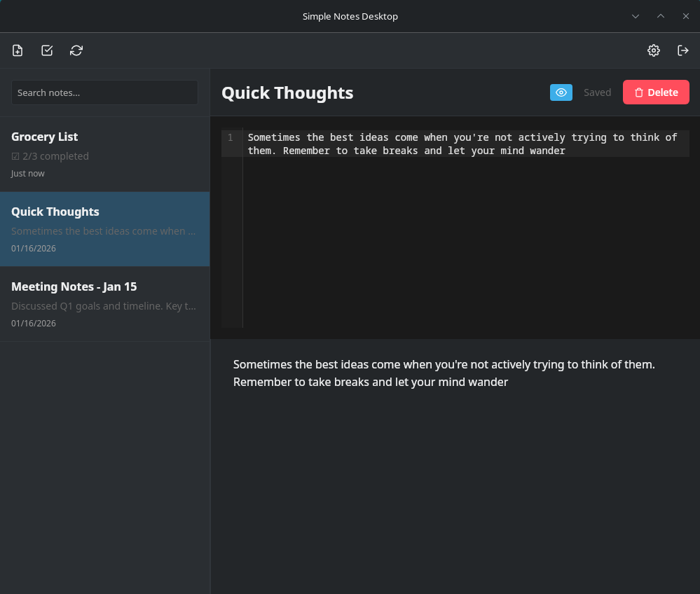
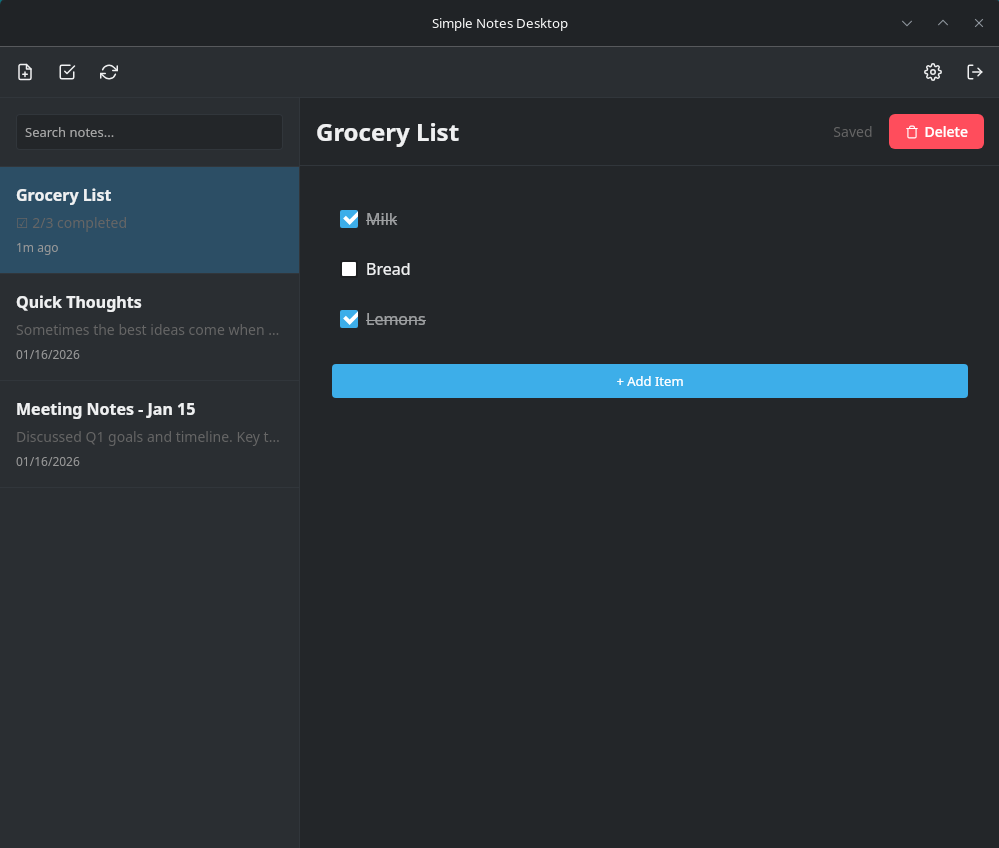
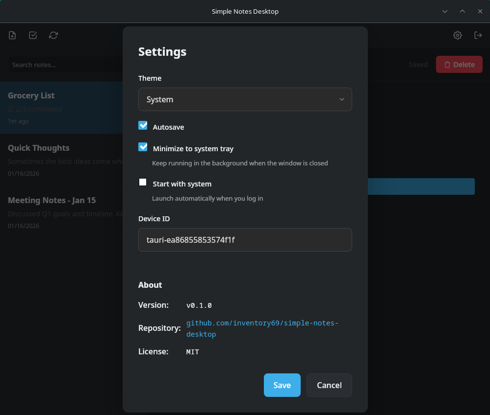

<div align="center">

</div>

<h1 align="center">Simple Notes Desktop</h1>

<h4 align="center">Cross-Platform Notizen-App mit WebDAV-Sync — der Desktop-Begleiter zu Simple Notes Sync.</h4>

<div align="center">

[](#-download)
[](#-download)
[](https://tauri.app/)
[](LICENSE)

</div>

<div align="center">

[📥 Download](#-download) · [📖 Dokumentation](#-dokumentation) · [🤝 Mitmachen](CONTRIBUTING.md)

**🌍** Deutsch · [English](README.md)

</div>

---

## 📥 Download

Lade das passende Paket für deine Plattform herunter:

| Plattform | Download | Format |
|-----------|----------|--------|
| **Windows** | [Download](https://github.com/inventory69/simple-notes-desktop/releases/latest) | `.msi` / `.exe` |
| **Linux (Debian/Ubuntu)** | [Download](https://github.com/inventory69/simple-notes-desktop/releases/latest) | `.deb` |
| **Linux (Fedora/RHEL)** | [Download](https://github.com/inventory69/simple-notes-desktop/releases/latest) | `.rpm` |
| **Arch Linux** | [Installationsanleitung](docs/ARCH_INSTALL.md) | AUR / AppImage |

---

## 📱 Screenshots

<p align="center">
  
</p>

<p align="center">
  
  
</p>

<div align="center">

📝 Markdown-Editor &nbsp;•&nbsp; ✅ Checklisten &nbsp;•&nbsp; 🔄 WebDAV-Sync &nbsp;•&nbsp; 🔽 System Tray &nbsp;•&nbsp; ⚙️ Einstellungen

</div>

---

## ✨ Highlights

- 📝 **Markdown-Editor** — Vollständiges Syntax-Highlighting mit Live-Vorschau (CodeMirror 6)
- ✅ **Checklisten** — Erstelle und verwalte Aufgabenlisten mit Tap-to-Check
- 🔄 **WebDAV-Sync** — Funktioniert mit Nextcloud, lokalen Servern und jedem WebDAV-Anbieter
- 🌓 **Dark/Light Mode** — Automatisches Theme basierend auf Systemeinstellungen
- 💾 **Auto-Speichern** — Verliere nie deine Arbeit durch automatisches Speichern
- 🔒 **Lokale Server** — Verbinde dich mit localhost (im Gegensatz zu PWA/Browser-Einschränkungen)
- 🔍 **Suche** — Finde Notizen schnell nach Titel oder Inhalt
- 🖥️ **Cross-Platform** — Windows und Linux mit nativer Performance

---

## 🔗 Simple Notes Ökosystem

Diese App ist Teil der **Simple Notes** Familie — alle Apps nutzen das gleiche Datenformat und synchronisieren nahtlos:

| App | Plattform | Beschreibung |
|-----|-----------|--------------|
| [**Simple Notes Sync**](https://github.com/inventory69/simple-notes-sync) | Android | Mobile App mit Offline-first Sync |
| **Simple Notes Desktop** | Windows/Linux | Du bist hier! Native Desktop-Erfahrung |

Die Desktop-App löst ein kritisches Problem: **Lokale WebDAV-Server** (localhost, private IPs wie `192.168.x.x`) können von browser-basierten PWAs nicht erreicht werden aufgrund von:
- Mixed Content (HTTPS → HTTP) Blocking
- CORS-Einschränkungen

Simple Notes Desktop nutzt native HTTP-Requests und umgeht diese Browser-Einschränkungen.

---

## 🚀 Schnellstart

### 1. Download & Installation

Lade das passende Paket für deine Plattform von der [Releases](https://github.com/inventory69/simple-notes-desktop/releases/latest) Seite herunter und installiere es.

### 2. WebDAV-Server einrichten

**Option A: Simple Notes Server (Docker)**

```bash
git clone https://github.com/inventory69/simple-notes-sync.git
cd simple-notes-sync/server
cp .env.example .env
# Bearbeite .env und setze dein Passwort
docker compose up -d
```

**Option B: Deine bestehende Nextcloud**

Deine WebDAV-URL wird sein:
```
https://deine-nextcloud.de/remote.php/dav/files/BENUTZERNAME/Notes/
```

### 3. Verbinden

1. Öffne Simple Notes Desktop
2. Gib deine WebDAV-URL, Benutzername und Passwort ein
3. Klicke **Verbinden**
4. Deine Notizen werden automatisch synchronisiert 🎉

➡️ **Detaillierte Anleitung:** [docs/SETUP.md](docs/SETUP.md)

---

## 📚 Dokumentation

| Dokument | Beschreibung |
|----------|--------------|
| [SETUP.md](docs/SETUP.md) | Detaillierte Installation & Konfiguration |
| [BUILDING.md](BUILDING.md) | Aus Quellcode bauen (Entwickler) |
| [CHANGELOG.md](CHANGELOG.md) | Versionsgeschichte |
| [ARCHITECTURE.md](docs/ARCHITECTURE.md) | Technische Architektur |

---

## 🔧 Problemlösungen

### Linux: AppImage startet nicht

Installiere fuse2 (benötigt für AppImage):
```bash
# Arch
sudo pacman -S fuse2

# Debian/Ubuntu
sudo apt install libfuse2
```

### macOS: "App ist beschädigt" (Gatekeeper)

Das passiert, weil die App nicht von Apple notarisiert ist:
```bash
xattr -cr "Simple Notes Desktop.app"
```

---

## 🤝 Mitmachen

Beiträge sind willkommen! Lies [CONTRIBUTING.md](CONTRIBUTING.md) für Richtlinien.

```bash
# Repository klonen
git clone https://github.com/inventory69/simple-notes-desktop.git
cd simple-notes-desktop

# Abhängigkeiten installieren
pnpm install

# Development Server starten
pnpm dev

# Für Produktion bauen
pnpm build
```

---

## 📄 Lizenz

MIT-Lizenz — siehe [LICENSE](LICENSE)

---

<div align="center">

**v0.2.0** · Mit ❤️ gebaut mit [Tauri](https://tauri.app/) + [CodeMirror](https://codemirror.net/)

</div>
