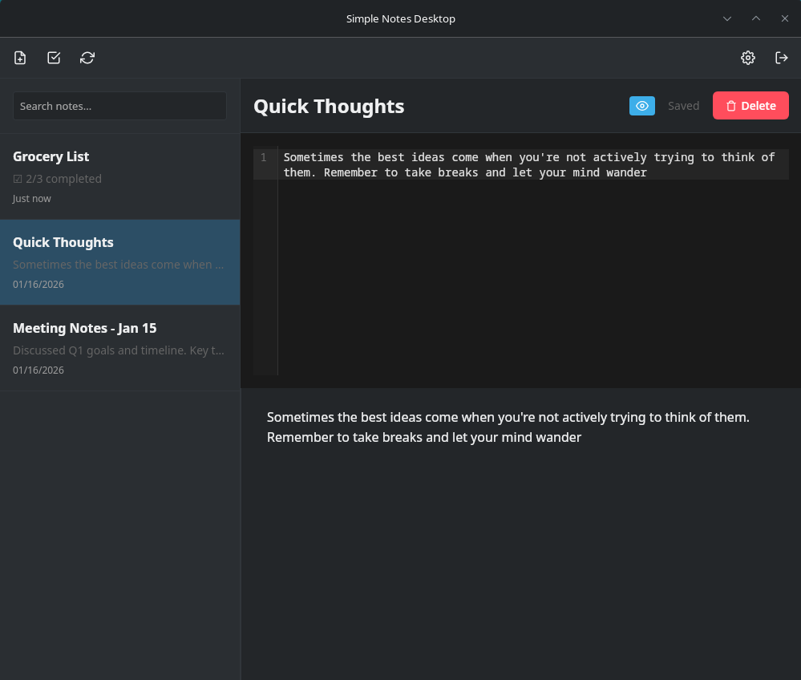
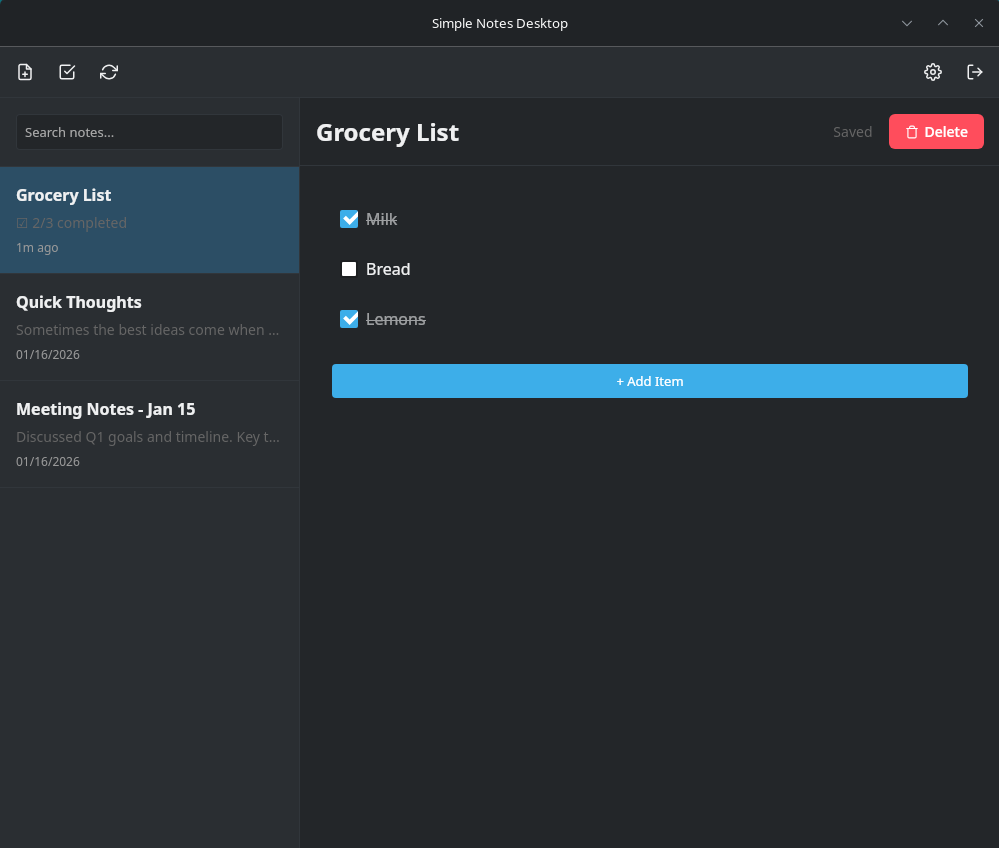
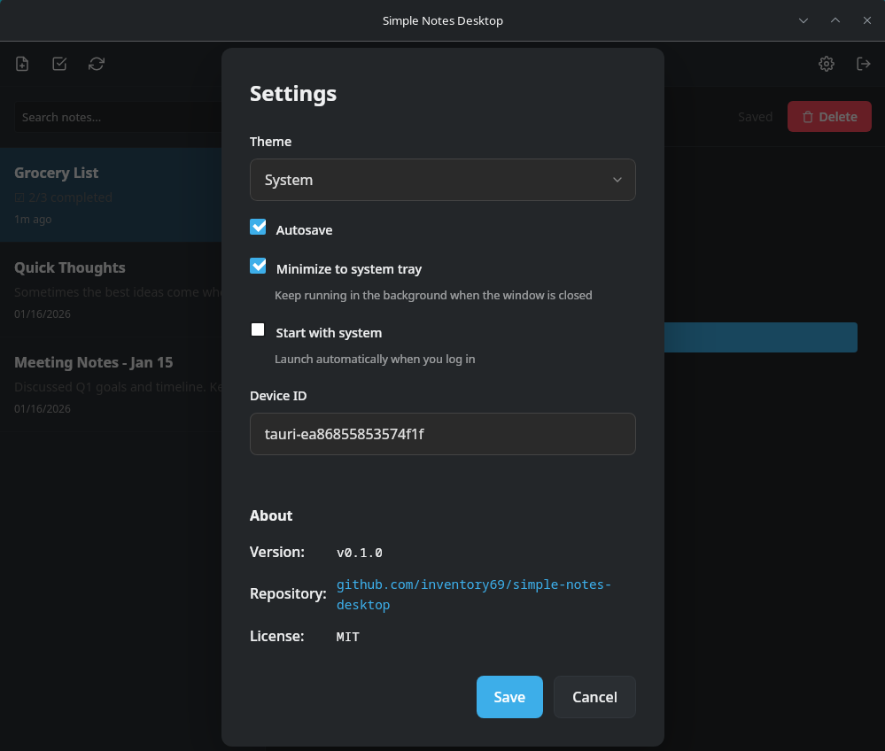

<div align="center">

</div>

<h1 align="center">Simple Notes Desktop</h1>

<h4 align="center">Cross-platform note-taking with WebDAV sync — the desktop companion to Simple Notes Sync.</h4>

<div align="center">

[](#-download)
[](#-download)
[](https://tauri.app/)
[](LICENSE)

</div>

<div align="center">

[📥 Download](#-download) · [📖 Documentation](#-documentation) · [🤝 Contributing](CONTRIBUTING.md)

**🌍** [Deutsch](README.de.md) · **English**

</div>

---

## 📥 Download

Download the latest release for your platform:

| Platform | Download | Format |
|----------|----------|--------|
| **Windows** | [Download](https://github.com/inventory69/simple-notes-desktop/releases/latest) | `.msi` / `.exe` |
| **Linux (Debian/Ubuntu)** | [Download](https://github.com/inventory69/simple-notes-desktop/releases/latest) | `.deb` |
| **Linux (Fedora/RHEL)** | [Download](https://github.com/inventory69/simple-notes-desktop/releases/latest) | `.rpm` |
| **Arch Linux** | [See installation guide](docs/ARCH_INSTALL.md) | AUR / AppImage |

---

## 📱 Screenshots

<p align="center">
  
</p>

<p align="center">
  
  
</p>

<div align="center">

📝 Markdown Editor &nbsp;•&nbsp; ✅ Checklists &nbsp;•&nbsp; 🔄 WebDAV Sync &nbsp;•&nbsp; 🔽 System Tray &nbsp;•&nbsp; ⚙️ Settings

</div>

---

## ✨ Highlights

- 📝 **Markdown Editor** — Full syntax highlighting with live preview (CodeMirror 6)
- ✅ **Checklists** — Create and manage task lists with tap-to-check
- 🔄 **WebDAV Sync** — Works with Nextcloud, local servers, and any WebDAV provider
- 🌓 **Dark/Light Mode** — Automatic theme based on system settings
- 💾 **Auto-save** — Never lose your work with automatic saving
- 🔒 **Local Server Support** — Connect to localhost (unlike PWA/browser limitations)
- 🔍 **Search** — Quickly find notes by title or content
- 🖥️ **Cross-platform** — Windows and Linux with native performance

---

## 🔗 Simple Notes Ecosystem

This app is part of the **Simple Notes** family — all apps share the same data format and sync seamlessly:

| App | Platform | Description |
|-----|----------|-------------|
| [**Simple Notes Sync**](https://github.com/inventory69/simple-notes-sync) | Android | Mobile app with offline-first sync |
| **Simple Notes Desktop** | Windows/Linux | You're here! Native desktop experience |
| [**Simple Notes Web**](https://github.com/inventory69/simple-notes-web) | Browser (PWA) | Web app for remote servers |

### Why Desktop?

The desktop app solves a critical limitation: **local WebDAV servers** (localhost, private IPs like `192.168.x.x`) cannot be accessed from browser-based PWAs due to:
- Mixed Content (HTTPS → HTTP) blocking
- CORS restrictions

Simple Notes Desktop uses native HTTP requests, bypassing these browser limitations.

---

## 🚀 Quick Start

### 1. Download & Install

Download the appropriate package for your platform from the [Releases](https://github.com/inventory69/simple-notes-desktop/releases/latest) page and install it.

### 2. Set Up WebDAV Server

**Option A: Use the Simple Notes Server (Docker)**

```bash
git clone https://github.com/inventory69/simple-notes-sync.git
cd simple-notes-sync/server
cp .env.example .env
# Edit .env and set your password
docker compose up -d
```

**Option B: Use your existing Nextcloud**

Your WebDAV URL will be:
```
https://your-nextcloud.com/remote.php/dav/files/USERNAME/Notes/
```

### 3. Connect

1. Open Simple Notes Desktop
2. Enter your WebDAV URL, username, and password
3. Click **Connect**
4. Your notes will sync automatically 🎉

➡️ **Detailed setup:** [docs/SETUP.md](docs/SETUP.md)

---

## 📚 Documentation

| Document | Description |
|----------|-------------|
| [SETUP.md](docs/SETUP.md) | Detailed installation & configuration |
| [BUILDING.md](BUILDING.md) | Build from source (developers) |
| [CHANGELOG.md](CHANGELOG.md) | Version history |
| [CONTRIBUTING.md](CONTRIBUTING.md) | Development setup & conventions |

---

## 🔧 Troubleshooting

### Linux: AppImage doesn't start

Install fuse2 (required for AppImage):
```bash
# Arch
sudo pacman -S fuse2

# Debian/Ubuntu
sudo apt install libfuse2
```

### Linux: Blank window / `EGL_BAD_PARAMETER` on Fedora Silverblue (Wayland)

On immutable distros like Fedora Silverblue 41+, the AppImage's bundled Wayland libraries can
conflict with the host's EGL stack, producing:

```
Could not create default EGL display: EGL_BAD_PARAMETER. Aborting...
```

Starting with v0.5.0 the app sets the required environment variables automatically. If you are
on an older version, use this workaround:

```bash
LD_PRELOAD=/usr/lib64/libwayland-client.so.0 ./simple_notes_desktop.appimage --no-sandbox
```

### Linux: App freezes when loading notes with certain emoji

On Fedora Silverblue 41+ the AppImage may freeze when a note contains color emoji (e.g. 🦛)
due to a COLRv1 rendering bug in the bundled WebKitGTK. Starting with v0.5.0 the app requests
text-style emoji rendering to avoid this code path. If you are on an older version, open the
note in the Android app and remove or replace the affected emoji, then re-sync.

### macOS: "App is damaged" (Gatekeeper)

This happens because the app isn't notarized by Apple. Run:
```bash
xattr -cr "Simple Notes Desktop.app"
```

---

## 🤝 Contributing

Contributions are welcome! Please read [CONTRIBUTING.md](CONTRIBUTING.md) for guidelines.

```bash
# Clone the repository
git clone https://github.com/inventory69/simple-notes-desktop.git
cd simple-notes-desktop

# Install dependencies
pnpm install

# Start development server
pnpm dev

# Build for production
pnpm build
```

---

## 📄 License

MIT License — see [LICENSE](LICENSE)

---

<div align="center">

**v0.9.0** · Built with ❤️ using [Tauri](https://tauri.app/) + [CodeMirror](https://codemirror.net/)

</div>
