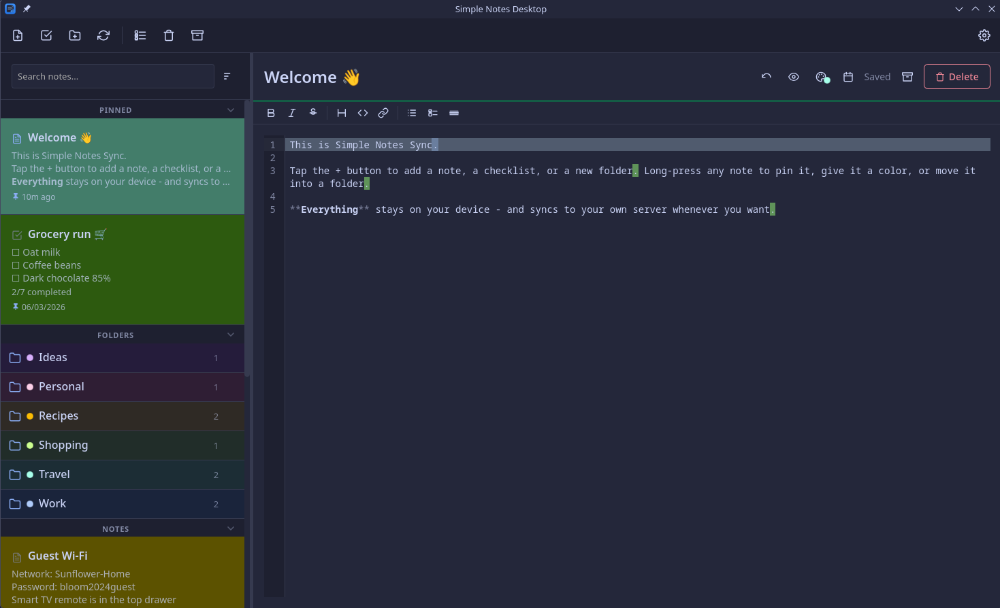
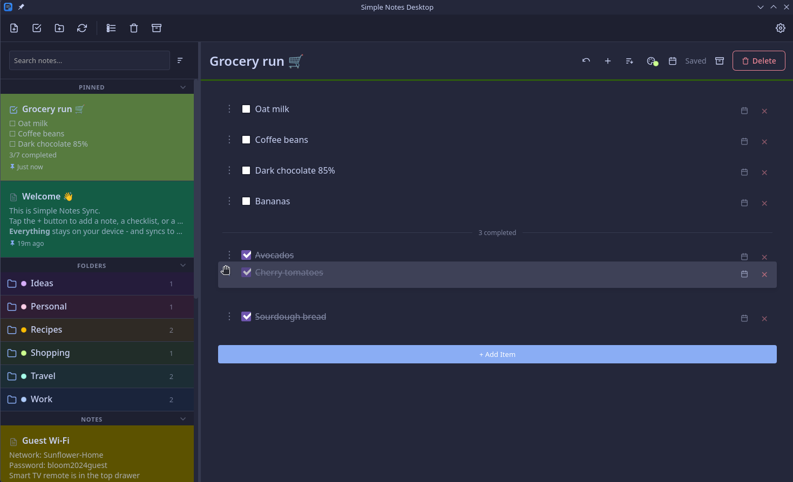
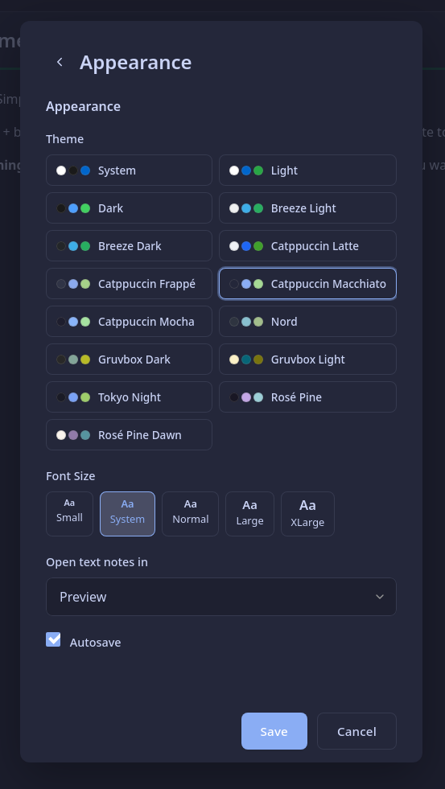

<div align="center">

</div>

<h1 align="center">Simple Notes Desktop</h1>

<h4 align="center">Local-first, cross-platform note-taking with WebDAV sync — the desktop companion to Simple Notes Sync.</h4>

<div align="center">

[](#-download)
[](#-download)
[](https://tauri.app/)
[](LICENSE)

</div>

<div align="center">

[📥 Download](#-download) · [📖 Documentation](#-documentation) · [🤝 Contributing](CONTRIBUTING.md)

**🌍** [Deutsch](README.de.md) · **English**

</div>

---

## 📥 Download

Download the latest release for your platform:

| Platform | Download | Format |
|----------|----------|--------|
| **Windows** | [Download](https://github.com/inventory69/simple-notes-desktop/releases/latest) | `.msi` / `.exe` |
| **Linux (Debian/Ubuntu)** | [Download](https://github.com/inventory69/simple-notes-desktop/releases/latest) | `.deb` |
| **Linux (Fedora/RHEL)** | [Download](https://github.com/inventory69/simple-notes-desktop/releases/latest) | `.rpm` |
| **Arch Linux** | [See installation guide](docs/ARCH_INSTALL.md) | AUR / AppImage |

Windows installs update themselves via the built-in updater. On Linux, update through your package manager or by downloading the newest release.

---

## 📱 Screenshots

<p align="center">
  
</p>

<p align="center">
  
  
</p>

<div align="center">

📝 Markdown Editor &nbsp;•&nbsp; ✅ Checklists &nbsp;•&nbsp; 📁 Folders &nbsp;•&nbsp; 🎨 15 Themes &nbsp;•&nbsp; 🔄 WebDAV Sync

</div>

---

## ✨ Highlights

- 🗄️ **Local-first & offline** — Notes are stored locally and are instantly editable with or without a server; WebDAV sync runs quietly in the background when connected
- 📝 **Markdown editor** — Syntax highlighting, formatting toolbar, and live preview (CodeMirror 6)
- ✅ **Checklists** — Tap-to-check items, drag-to-reorder, 5 sort modes, done/open separator
- 📁 **Folders** — Organise notes into folders; mark a folder **local-only** to keep it off the server
- 🗑️ **Trash** — Soft-delete with restore, permanent delete, and cross-device deletion sync
- 📌 **Pin, color & sort** — Pin notes to the top, apply Keep-compatible colors, and sort the list five ways
- 🔀 **Multi-select** — Batch pin, color, move, or delete notes (F6)
- 🎨 **15 themes** — Breeze, Catppuccin, Nord, Gruvbox, Tokyo Night, Rosé Pine, and more — plus System/Light/Dark
- 🔄 **WebDAV sync** — Works with Nextcloud, the Simple Notes server, and any WebDAV provider
- 🔒 **Local server support** — Connect to `localhost` and private IPs that browser PWAs can't reach
- 📄 **Markdown export** — Human-readable `.md` copies written alongside the JSON on the server
- 🔍 **Search** — Filter notes by title or content as you type
- 🖥️ **Native desktop** — System tray, autostart, resizable sidebar, and (on Windows) an in-app updater

---

## 🔗 Simple Notes Ecosystem

This app is part of the **Simple Notes** family — all apps share the same data format and sync seamlessly:

| App | Platform | Description |
|-----|----------|-------------|
| [**Simple Notes Sync**](https://github.com/inventory69/simple-notes-sync) | Android | Mobile app with offline-first sync |
| **Simple Notes Desktop** | Windows/Linux | You're here! Native desktop experience |

### Why Desktop?

The desktop app solves a critical limitation: **local WebDAV servers** (localhost, private IPs like `192.168.x.x`, plain `http://`) cannot be accessed from browser-based PWAs due to:
- Mixed Content (HTTPS → HTTP) blocking
- CORS restrictions

Simple Notes Desktop uses native HTTP requests, bypassing these browser limitations.

---

## 🚀 Quick Start

### 1. Download & install

Grab the package for your platform from the [Releases](https://github.com/inventory69/simple-notes-desktop/releases/latest) page and install it. The app opens straight into a working, **offline** notebook — no account or server required.

### 2. (Optional) Set up a WebDAV server

Sync is only needed if you want your notes on other devices.

**Option A — Simple Notes Server (Docker)**

```bash
git clone https://github.com/inventory69/simple-notes-sync.git
cd simple-notes-sync/server
cp .env.example .env
# Edit .env and set your password
docker compose up -d
```

**Option B — your existing Nextcloud**

```
https://your-nextcloud.com/remote.php/dav/files/USERNAME/Notes/
```

### 3. Connect

1. Open **Settings** (⚙️)
2. Turn **Offline mode** off and enter your WebDAV URL, username, and password
3. Hit **Test connection**, then **Save**
4. Your notes sync automatically in the background 🎉

➡️ **Detailed setup:** [docs/SETUP.md](docs/SETUP.md)

---

## ⌨️ Keyboard Shortcuts

| Shortcut | Action |
|----------|--------|
| `Ctrl+N` | New note |
| `Ctrl+Shift+N` | New checklist |
| `Ctrl+S` | Save now |
| `Ctrl+F` | Search notes |
| `Ctrl+B` / `Ctrl+I` | Bold / italic (editor) |
| `Ctrl+Z` | Undo |
| `F6` | Toggle multi-select |
| `Esc` | Close dialog / clear search |

---

## 📚 Documentation

| Document | Description |
|----------|-------------|
| [SETUP.md](docs/SETUP.md) | Detailed installation & configuration |
| [BUILDING.md](BUILDING.md) | Build from source (developers) |
| [CHANGELOG.md](CHANGELOG.md) | Version history |
| [CONTRIBUTING.md](CONTRIBUTING.md) | Development setup & conventions |

---

## 🔧 Troubleshooting

### Linux: AppImage doesn't start

Install fuse2 (required for AppImage):
```bash
# Arch
sudo pacman -S fuse2

# Debian/Ubuntu
sudo apt install libfuse2
```

---

## 🤝 Contributing

Contributions are welcome! Please read [CONTRIBUTING.md](CONTRIBUTING.md) for guidelines.

```bash
# Clone the repository
git clone https://github.com/inventory69/simple-notes-desktop.git
cd simple-notes-desktop

# Install dependencies (pnpm required)
pnpm install

# Start development server
pnpm dev

# Build for production
pnpm build
```

---

## 📄 License

MIT License — see [LICENSE](LICENSE)

---

<div align="center">

**v0.11.0** · Built with ❤️ using [Tauri](https://tauri.app/) + [CodeMirror](https://codemirror.net/)

</div>
